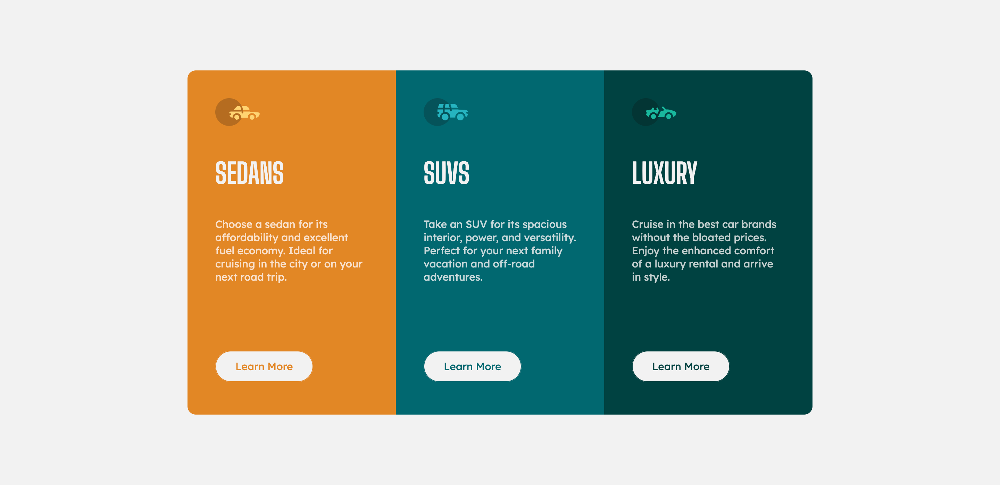
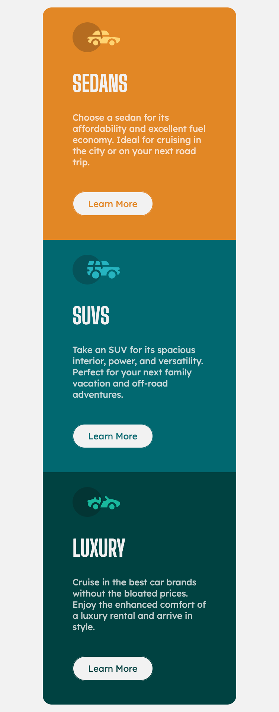
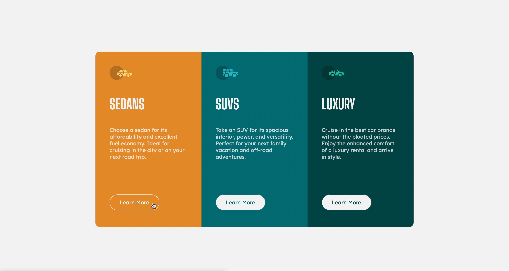

# 3-column preview card component solution

## Table of contents

- [Overview](#overview)
  - [The challenge](#the-challenge)
  - [Screenshot](#screenshot)
  - [Links](#links)
- [My process](#my-process)
  - [Built with](#built-with)

## Overview

### The challenge

Users should be able to:

- View the optimal layout depending on their device's screen size
- See hover states for interactive elements

### Screenshot

### Links

- Live Site URL: [https://ozantank.github.io/3-column-preview/](https://ozantank.github.io/3-column-preview/)

## My process

### Built with

- CSS custom properties
- Flexbox
- CSS Grid
